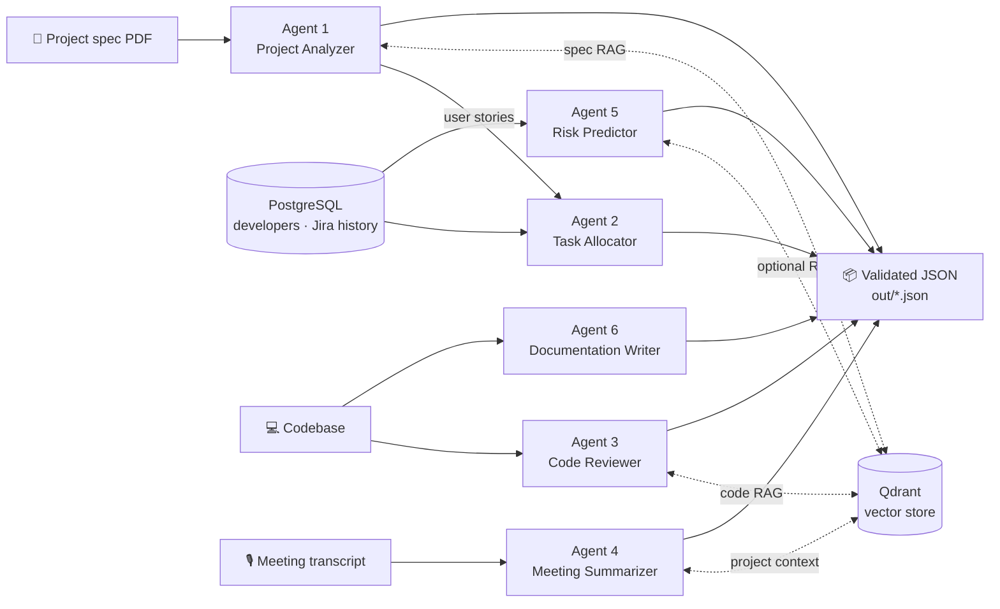

# Project Management AI Agents

**Six LangGraph agents that take a software project from specification to delivery** — they analyse requirements, allocate tasks, review code, summarise meetings, predict risks and write documentation.

Each agent is a stateful graph with **RAG grounding** and **strict Pydantic structured output**, so every result is valid JSON that the next agent (or a database) can consume — not free-form chat.


-F55036)


---

## The agents

| # | Agent | Input → Output | Graph |
|---|---|---|---|
| 1 | **Project Analyzer** | Spec PDF → actors, user stories, technical constraints, risks | plan → retrieve → synthesize |
| 2 | **Task Allocator** | User stories + team (PostgreSQL) → task assignments | skill-match scoring |
| 3 | **Code Reviewer** | Codebase → findings with severity and fixes | retrieve → review → **self-critique** → merge |
| 4 | **Meeting Summarizer** | Transcript → summary, decisions, action items | chunk → retrieve → **map → reduce** |
| 5 | **Risk Predictor** | Jira-style history → risk factors, delay prediction, mitigations, alerts | analytics → retrieve → predict |
| 6 | **Documentation Writer** | Codebase → README + API docs, coverage %, obsolete-doc warnings (EN/FR/ES) | **ReAct** tool loop → generate |

## How they connect



## Engineering highlights

**Parent–child RAG for specifications (Agent 1).**
Small child chunks (~400 chars) are indexed for precise matching; the larger parent chunk (~2,000 chars) is what the LLM actually reads. This gives keyword-level recall without losing the surrounding context of a requirement.

**AST-aware RAG for code (Agent 3).**
Code is split by functions and classes with Python's `ast` module — not by character count. Each chunk carries `file`, `class`, `function` and `imports` metadata, so the reviewer knows *where* a function lives and *what it depends on* instead of judging an isolated snippet.

**Reviewer + critic loop (Agent 3).**
A second LLM pass critiques the draft review and adds findings the first pass missed, then both are merged into one result.

**Map-reduce summarisation (Agent 4).**
Long transcripts are chunked with overlap, summarised in parallel, then reduced into one structured summary — optionally grounded in the project spec.

**ReAct documentation agent (Agent 6).**
The agent explores the codebase with tools, then generates documentation, measures docstring coverage and flags obsolete docs — in English, French or Spanish.

**Structured output everywhere.**
Every agent returns a Pydantic v2 model (`ProjectAnalysis`, `TaskAllocationResult`, `CodeReviewResult`, `MeetingSummary`, `RiskReport`, `DocumentationResult`) via `.with_structured_output(...)`.

## Tech stack

| Layer | Technologies |
|---|---|
| Agents | LangGraph, LangChain |
| LLM | Llama 3.3 70B via Groq |
| RAG | Qdrant, HuggingFace embeddings (`all-MiniLM-L6-v2`), ParentDocumentRetriever |
| Data | PostgreSQL (Docker), Pydantic v2 |
| Language | Python 3.10+ with type hints |

## Project structure

```
src/
  agents/
    agent1/ … agent6/   graph.py (LangGraph workflow) + models.py (Pydantic schemas)
  rag/
    ingestion_advanced.py   parent–child PDF ingestion
    code_ingestion.py       AST-aware code ingestion
    agent5_ingestion.py     risk-context ingestion
  infrastructure/           PostgreSQL setup and checks
scripts/                    run_agent1.py … run_agent6.py, test_agents.py
```

## Getting started

```bash
git clone https://github.com/mouataz5/gestion-project-agents.git
cd gestion-project-agents
python3 -m venv .venv && source .venv/bin/activate
pip install -r requirements.txt
cp .env.example .env              # set GROQ_API_KEY (https://console.groq.com/keys)

# PostgreSQL for Agents 2 and 5
docker compose -p agentdata up -d
python -m src.infrastructure.setup_postgres
```

Qdrant runs locally in `qdrant_data/` by default, or set `QDRANT_URL` / `QDRANT_API_KEY` in `.env`.

### Run the agents

```bash
python scripts/run_agent1.py path/to/spec.pdf                 # analyse a spec
python scripts/run_agent2.py                                  # allocate tasks
python scripts/run_agent3.py path/to/code                     # review code
python scripts/run_agent4.py path/to/transcript.txt           # summarise a meeting
python scripts/run_agent5.py --rag --pdf path/to/spec.pdf     # risk report
python scripts/run_agent6.py src --lang fr                    # generate docs in French

python scripts/test_agents.py --all                           # smoke-test every agent
```

Results are written to `out/` (e.g. `agent1_analysis.json`, `agent5_risk_report.json`).

More detail: [SETUP.md](SETUP.md) · [PROJECT_CONTEXT.md](PROJECT_CONTEXT.md)

## Author

**Mouataz Bouazizi** — AI Engineer · [LinkedIn](https://www.linkedin.com/in/moataz-bouazizi-409068245/)
